<div align="center">

<picture>
  <source media="(prefers-color-scheme: light)" srcset="assets/terminal.svg">
  
</picture>

<br>

# ISHANT // AI SYSTEMS LAB

**AI & Backend Developer** — Agentic AI · RAG · Backend Systems · Developer Tools

</div>

<br>

## 00 / SYSTEM

```
> node        Ishant Yadav
> role        AI & Backend Developer
> base        Mariahu, Uttar Pradesh, India
> education   Dronacharya Group of Institutions, Greater Noida
> stack       LangChain · LangGraph · RAG · FastAPI · PostgreSQL · Redis
```

<br>

## 01 / ABOUT

I work on AI-powered backend systems — agentic workflows, retrieval pipelines,
and the FastAPI/PostgreSQL/Redis layer that has to sit underneath them for any
of it to run reliably outside a notebook. My interest is less in the demo and
more in the part after the demo: turning an LLM capability into something
that behaves predictably as a service.

Builder first, currently completing my education at Dronacharya Group of
Institutions, Greater Noida — second.

<br>

## 02 / CURRENT FOCUS

```
Agentic AI & AI Agents
Retrieval-Augmented Generation (RAG)
LangChain / LangGraph
FastAPI backend systems
PostgreSQL / Redis
Developer tooling
```

<br>

## 03 / WHAT I BUILD

| Area | Focus |
|---|---|
| **AI & Agentic Systems** | Multi-step agent workflows orchestrated with LangChain / LangGraph |
| **RAG & Intelligent Search** | Retrieval pipelines connecting vector/embedding search to LLM generation |
| **Backend Platforms** | FastAPI services backed by PostgreSQL and Redis |
| **Developer Tools & Automation** | Tooling that removes repetitive steps from an AI or backend workflow |

<br>

## 04 / STACK

<table>
<tr>
<td valign="top" width="50%">

**Languages**


**AI / Agent Systems**


</td>
<td valign="top" width="50%">

**Backend**


**Tools**


</td>
</tr>
</table>

> These reflect stated focus areas and tooling. Anything more granular
> (frontend framework choices, data infra beyond what's listed) will be
> added here once verified against specific repositories — see `05` below.

<br>

## 05 / FEATURED SYSTEMS

> **Note:** this section is intentionally left as a template rather than
> filled with guessed project details. Populate each block below with a
> real repository once you're ready — name, one-line technical
> description, actual stack used, and the repo link — and the row
> renders itself. Delete unused template rows.

<table>
<tr>
<td width="33%" valign="top">

**[FBADIS](https://fbadis.qzz.io)**

_One-line technical description goes here._

`stack` · `goes` · `here`

[Repository](#) · [Live](https://fbadis.qzz.io)

</td>
<td width="33%" valign="top">

**[Project Name]**

_One-line technical description goes here._

`stack` · `goes` · `here`

[Repository](#)

</td>
<td width="33%" valign="top">

**[Project Name]**

_One-line technical description goes here._

`stack` · `goes` · `here`

[Repository](#)

</td>
</tr>
</table>

<br>

## 06 / GITHUB TELEMETRY

<div align="center">


</div>

<br>

## 07 / CONTRIBUTION MATRIX

<div align="center">

</div>

<br>

## 08 / CONNECT

<div align="center">

[](https://github.com/YadavIshant0808)
[](https://www.linkedin.com/in/yadavishant1)

</div>

<br>

<div align="center">
<sub>Auto-regenerated: terminal hero on config change · telemetry daily · contribution matrix daily</sub>
</div>
